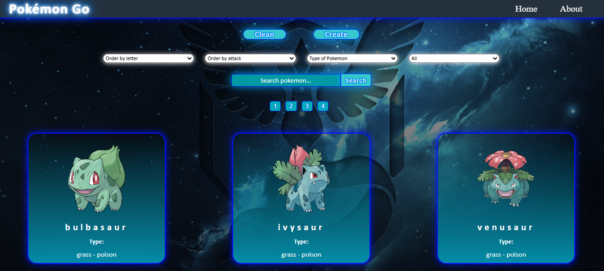
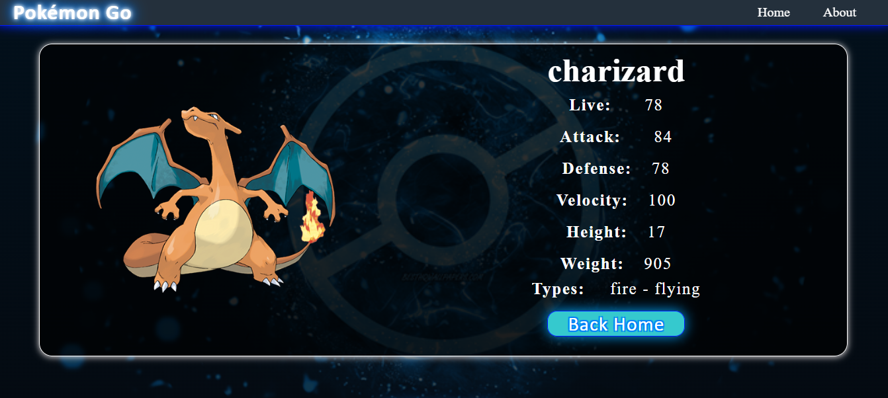
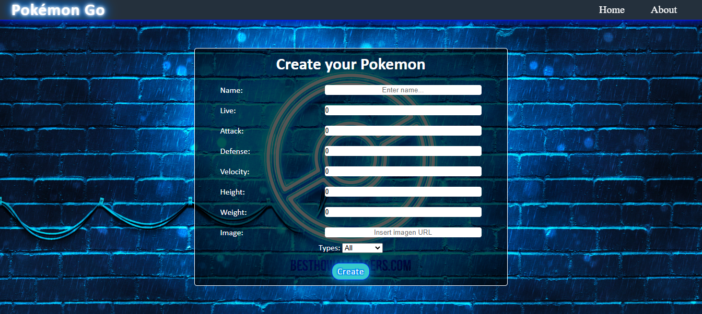
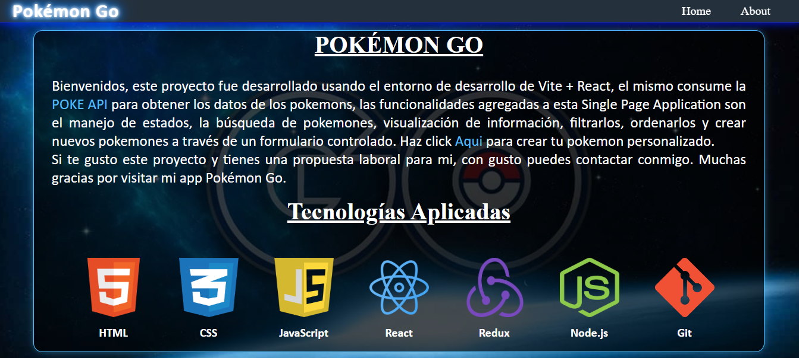
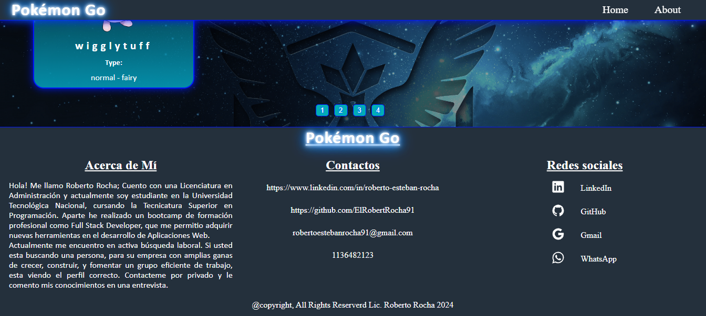

# Proyecto POKEMON GO

Este proyecto a sido desarrollado usando la plantilla de desarrollo para proyectos en React con Vite.

- [Vite](https://vitejs.dev/)

## Objetivos del proyecto

El proposito de este proyecto es poner en práctica los conocimientos en desarrollo Frontend. Construyendo una Single Page Application afirmando los conceptos aprendidos en el desarrollo web, poniendo en práctica recursos básicos en estilos y diseños (UX - UI), arquitectura de software, buenas prácticas de código y workflow de GIT.

### Caracteristicas y funcionalidades

La idea de este proyecto es construir una aplicación web usando la API [POKEAPI](https://pokeapi.co/) en la que se pueda:

- Buscar pokemones.
- Visualizar la información de los pokemones.
- Filtrarlos.
- Ordenarlos.
- Crear nuevos pokemones.

### Tecnologías utilizadas

Las tecnologías usadas para la creación y desarrollo de este proyecto son las siguientes:

- HTML.
- CSS.
- JavaScript.
- React.
- Redux.
- Node.
- Git.

## Imagénes del proyecto

### - Landing


### - Home



### - Detail



### - Form



### - About



### - Footer and Paginate



# Descarga

¡Te gusto mí proyecto! Te invito a que lo descargues y lo pruebes de manero local en tu PC

```
git clone https://github.com/ElRobertRocha91/api-pokemon-app.git
cd api-pokemon-app
npm install
npm run dev
```
# Contacto

- Gmail: [@robertoestebanrocha91@gmail.com](https://www.google.com/intl/es-419/gmail/about/)
- LinkedIn: [Roberto Esteban Rocha](https://www.linkedin.com/in/roberto-esteban-rocha)
- Portfolio: [Sitio web personal](https://my-portfolio-iota-kohl-81.vercel.app/)
